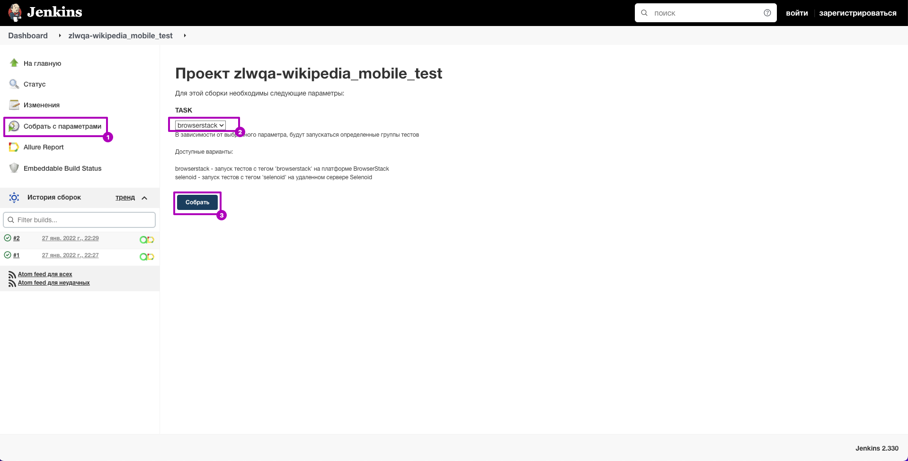
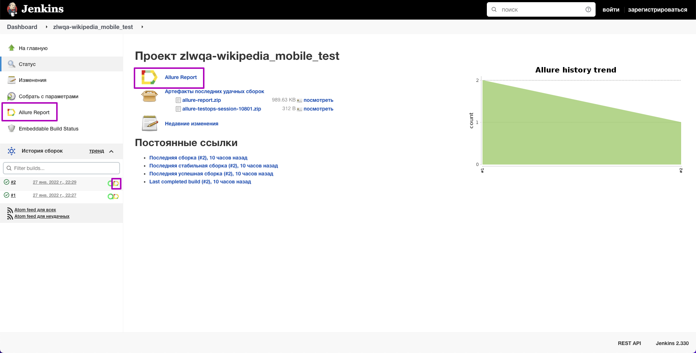
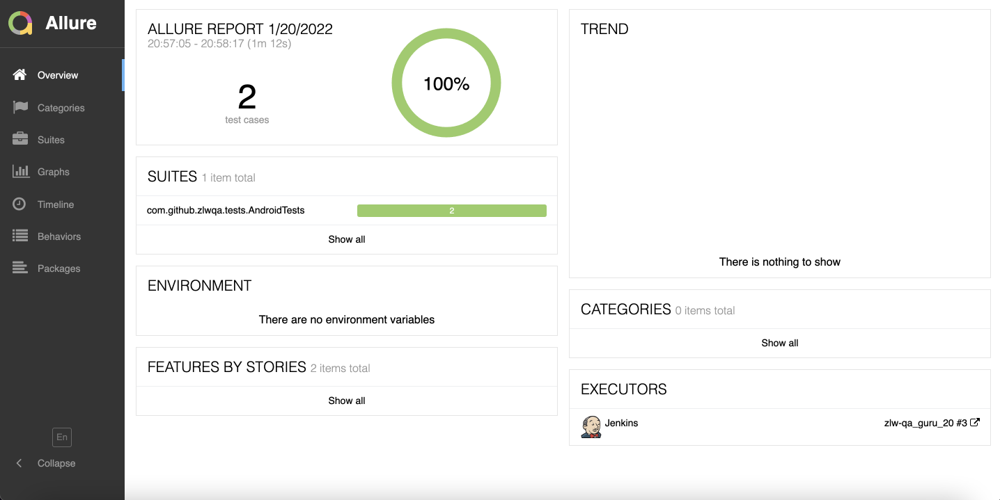
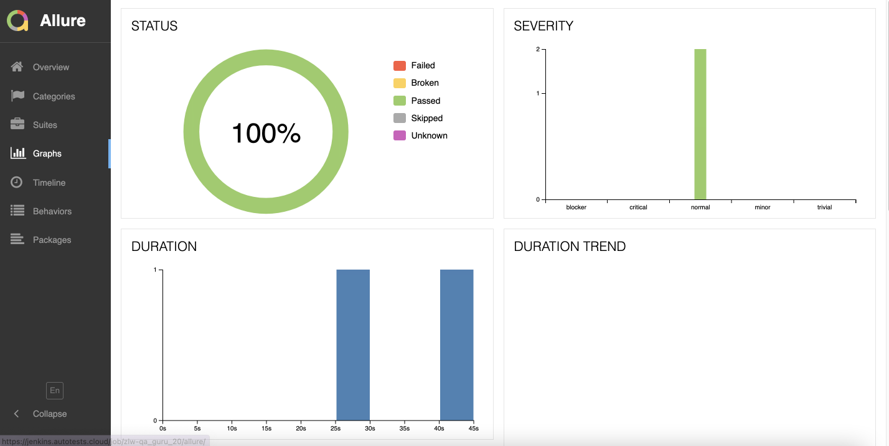
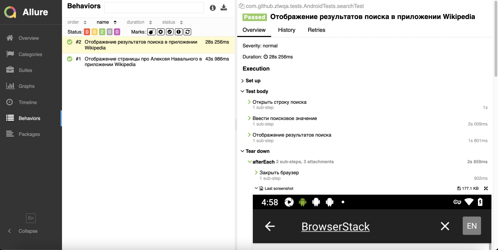
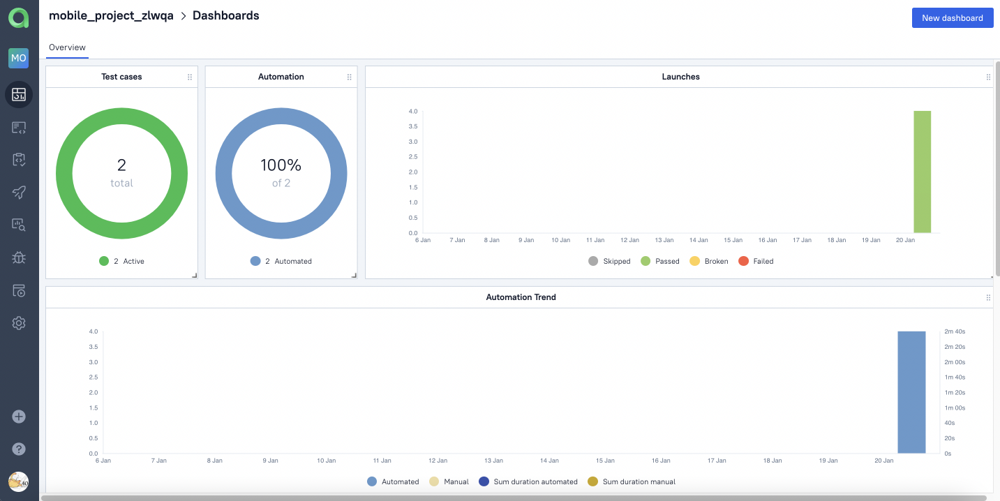
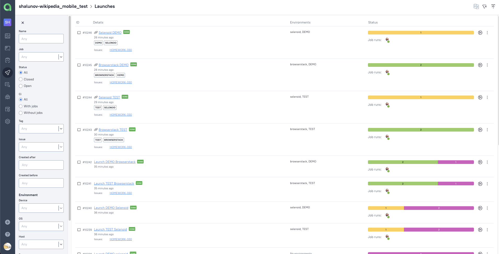
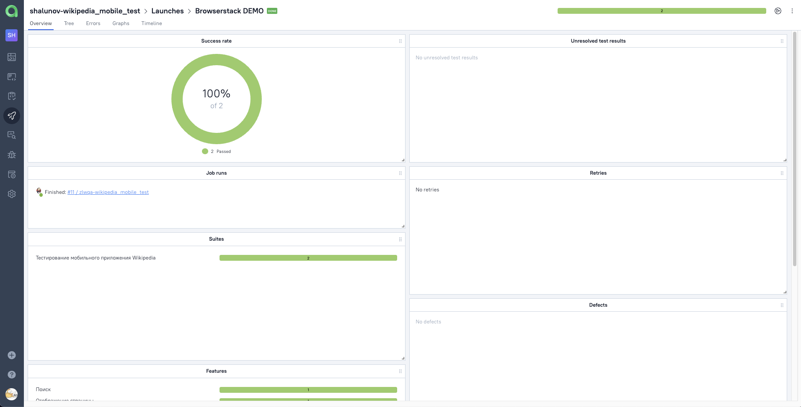
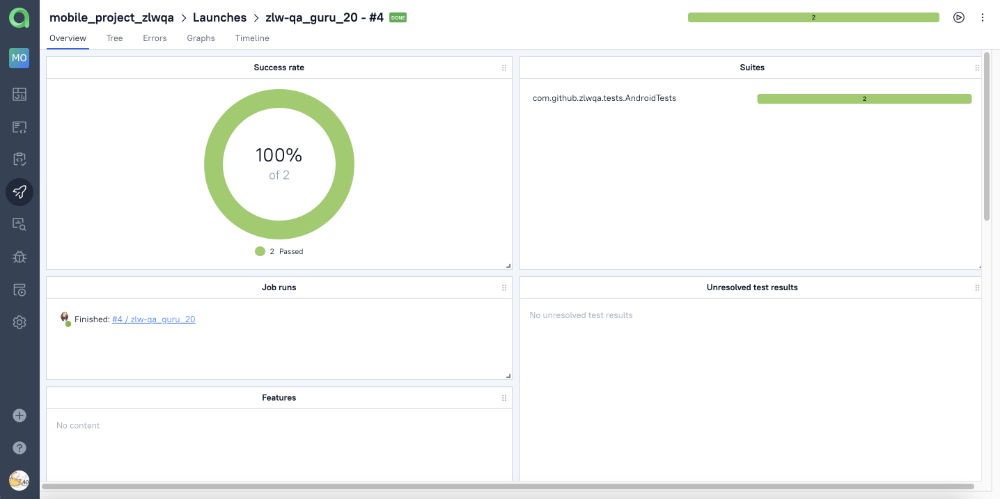

# Проект по автоматизации тестирования UI для [Wikipedia](https://ru.wikipedia.org/wiki/)

##  Покрытый функционал

### UI

- :white_check_mark: Отображение результатов поиска в приложении Wikipedia
- :white_check_mark: Отображение определенной страницы в приложении Wikipedia

##  Технологический стек

<p align="center">


</p>

> В данном проекте автотесты написаны на <code>Java</code> с использованием фреймворка <code>Selenide</code> для UI проверок и библиотеки <code>REST Assured</code> для отображения видео в отчете
>
> <code>JUnit 5</code> используется для модульного тестирования
>
> <code>Gradle</code> используется для автоматизированной сборки проекта
>
> <code>Jenkins</code> выполняет запуск тестов
>
> <code>BrowserStack</code> выполняет запуск приложения на удаленном мобильном устройстве
>
> <code>Allure Report</code> формирует отчет о запуске тестов
>
> Автотесты интегрируются с тест-менеджмент системой <code>Allure TestOps</code>

##  Запуск тестов из терминала

<details>
<summary>Подробнее</summary>

### :rocket: Запуск тестов в [BrowserStack](https://www.browserstack.com/)

```
gradle clean test
```

> <details>
> <summary>:exclamation:</summary>
>
> + Для запуска тестов необходим файл <code>androidMobile.properties</code>. В нем должны быть заполнены следующие значения _userName_, _accessKey_  и _appUrl_. _userName_ и _accessKey_ расположены в настройках <code>BrowserStack</code> для <code>App Automate</code>, _appUrl_ - ссылка на тестируемое приложение.
> </details>

</details>

##  Формирование отчета Allure

<details>
<summary>Подробнее</summary>

> <details>
> <summary>:exclamation:</summary>
>
> + Предварительно необходимо установить _Allure_
> </details>

```
allure serve build/allure-results
```

</details>

##  Запуск тестов в [Jenkins](https://jenkins.autotests.cloud/job/zlw-qa_guru_20/)

<details>
<summary>Подробнее</summary>

### :triangular_flag_on_post:     Для запуска тестов в Jenkins необходимо выполнить следующие шаги:

1. Открыть сборку [Jenkins](https://jenkins.autotests.cloud/job/zlw-qa_guru_20/)
2. Нажать на таск <code>"Собрать с параметрами"</code>

<p align="center">

</p>

### :triangular_flag_on_post: Для формирования отчета о прохождении тестов в Allure Report необходимо выполнить следующий шаг:

3. После выполнения сборки нажать на любую ссылку/иконку <code>"Allure Report"</code>

<p>

</p>

</details>

##  Отчет о результатах тестирования в [Allure Report](https://jenkins.autotests.cloud/job/zlw-qa_guru_20/allure/)

<details>
<summary>Подробнее</summary>

> <code>Allure-framework</code> используется в качестве инструмента для построения отчетов о прогоне автотестов.
> Он позволяет получить информацию о ходе выполнения тестов, а также прикрепить скриншоты, логи и видео к формируемому отчету.
> Имеется возможность указать различные теги, приоритеты и прочую сопутствующую информацию для тестов.

### :dart: Главная страница Allure-отчета

<p align="center">

</p>

### :dart: Информация о тестовом прогоне в графическом виде

<p align="center">

</p>

### :dart: Группировка тестов по проверяемому функционалу

<p align="center">

</p>

</details>

##  Интеграция тестов c тест-менеджмент системой [Allure TestOps](https://allure.autotests.cloud/project/907/dashboards)

<details>
<summary>Подробнее</summary>

> <code>Allure TestOps</code> - это платформа управления качеством программного обеспечения, объединяющая автоматическое и ручное тестирование, которая позволяет управлять всем, что связано с тестированием, в одном месте.

### :test_tube:     Основной дашборд

<p align="center">

</p>

### :test_tube:     Запуски тестов

<p align="center">

</p>

### :test_tube:     Результаты запуска тестов

<p align="center">

</p>

### :test_tube: Сгруппированные тест-кейсы по проверяемому функционалу

<p align="center">

</p>

</details>

##  Пример запуска теста в Browserstack

<details>
<summary>Подробнее</summary>

> Для каждого теста записывается и прилагается видео прогона.

<p align="center">
  
</p>

</details>

<details>
<summary>:heartbeat: </summary>

### Спасибо за идею оформления [jjfhj](https://github.com/jjfhj)

</details>

