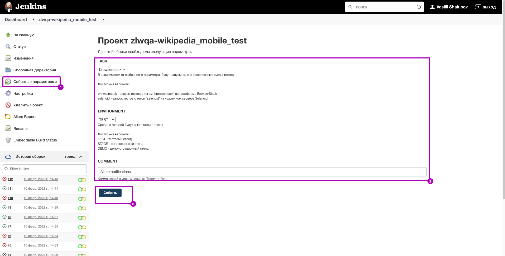
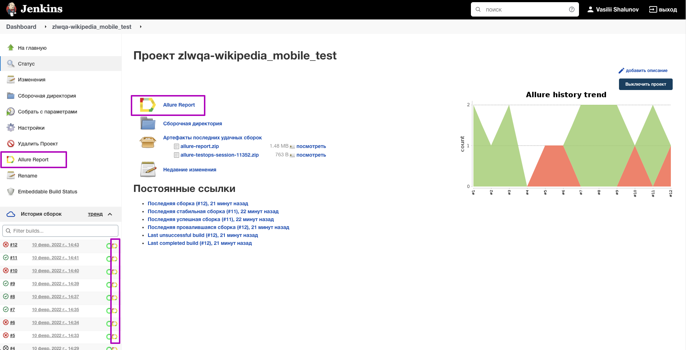
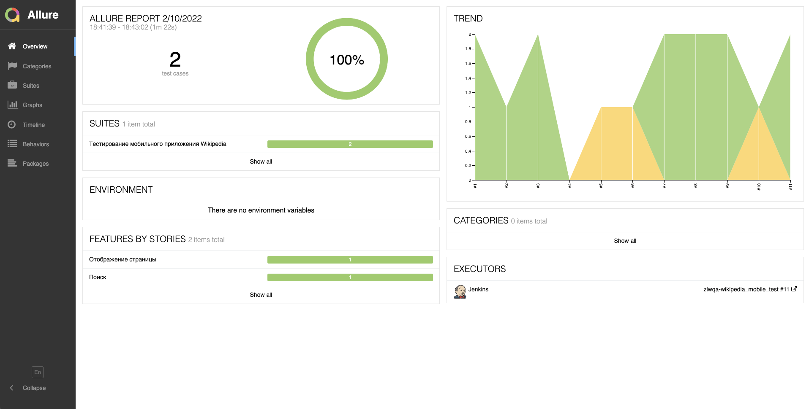
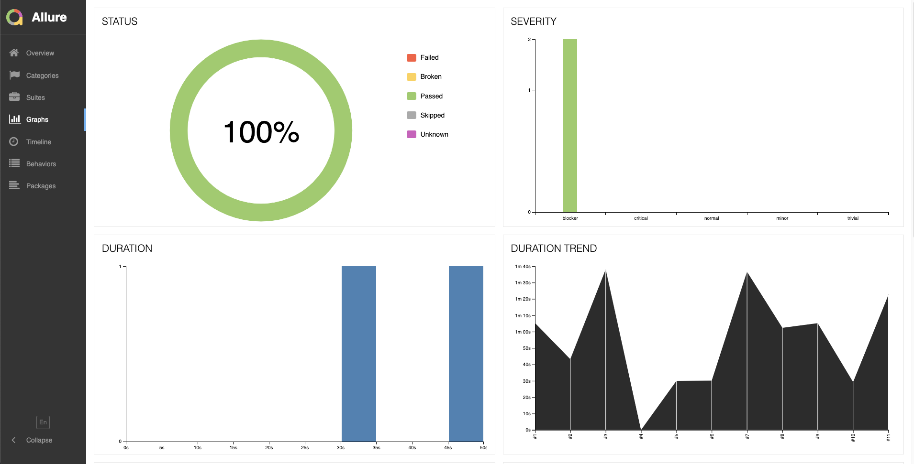
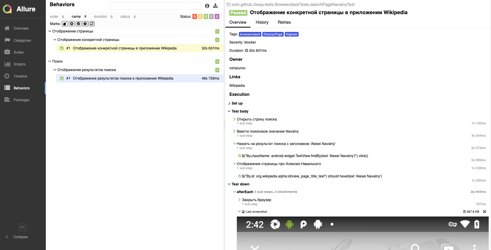
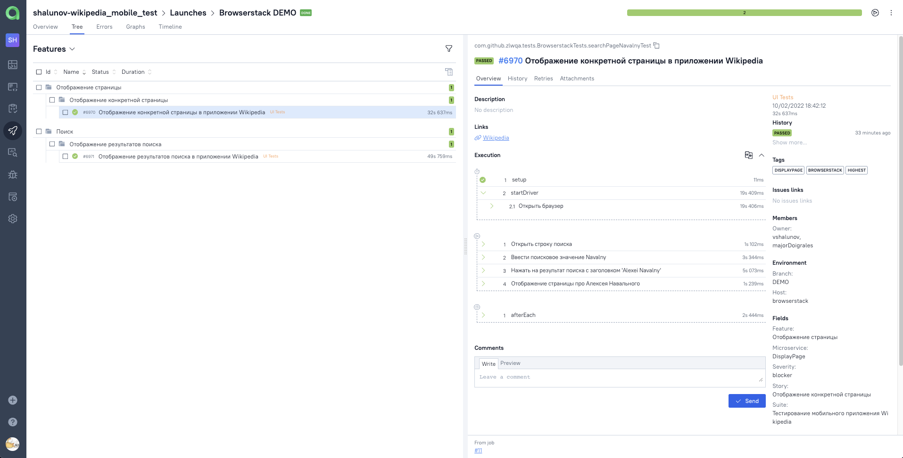
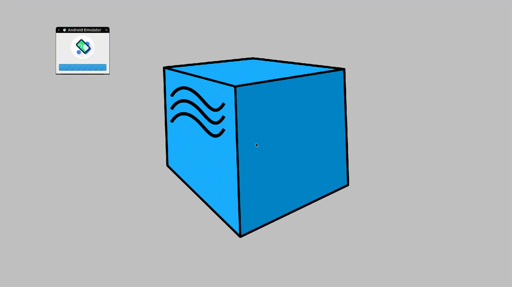

# Проект по автоматизации тестирования UI для [Wikipedia](https://ru.wikipedia.org/wiki/)

##  Покрытый функционал

### UI

- :white_check_mark: Отображение результатов поиска в приложении Wikipedia
- :white_check_mark: Отображение определенной страницы в приложении Wikipedia
- :white_check_mark: Проверка первых четырех экранов Getting Started
- 
##  Технологический стек

<p align="center">


</p>

> В данном проекте автотесты написаны на <code>Java</code> с использованием фреймворка <code>Selenide</code> и <code>Appium</code> для UI проверок, и библиотеки <code>REST Assured</code> для отображения видео в отчете
>
> <code>JUnit 5</code> используется для модульного тестирования
>
> <code>Gradle</code> используется для автоматизированной сборки проекта
>
> <code>Jenkins</code> выполняет запуск тестов
>
> <code>BrowserStack</code> выполняет запуск приложения на удаленном мобильном устройстве
>
> <code>Allure Report</code> формирует отчет о запуске тестов
>
> Автотесты интегрируются с тест-менеджмент системой <code>Allure TestOps</code>

##  Запуск тестов из терминала

<details>
<summary>Подробнее</summary>

### :rocket: Запуск тестов

```
gradle clean ${TASK}
```

> <details>
> <summary>:exclamation: Для запуска тестов необходимы файлы, в которых прописаны определенные параметры: </summary>
> <details>
> <summary> <code>browserstack.properties</code> </summary>
>
> + <code>userName</code> и <code>accessKey</code> – расположены в настройках <code>BrowserStack</code> для <code>App Automate</code>
> + <code>appUrl</code> – ссылка на тестируемое приложение
> + <code>deviceName</code> – наименование мобильного устройства, на котором будут запускаться тесты
> + <code>osVersion</code> – версия операционной системы мобильного устройства
> + <code>remoteURL</code> – URL удаленного сервера, на котором будут запускаться тесты 
> </details>
>
> <details>
> <summary> <code>local.properties</code> </summary>
>
> + <code>deviceName</code> – наименование мобильного устройства, на котором будут запускаться тесты
> + <code>platformName</code> – имя платформы, на которой будут запускаться тесты
> + <code>version</code> – версия операционной системы мобильного устройства
> + <code>locale</code> – локализация приложения (<code>en</code>,<code>ru</code> и т.д.)
> + <code>language</code> – язык приложения (<code>en</code>,<code>ru</code> и т.д.)
> + <code>appPackage</code> – идентификатор пакета приложения
> + <code>appActivity</code> – название основной активности приложения
> + <code>app</code> – путь до тестируемого приложения
> + <code>remoteURL</code> – URL удаленного сервера, на котором будут запускаться тесты
> </details>
>
> <details>
> <summary> <code>realDevice.properties</code> </summary>
>
> + <code>deviceName</code> – наименование мобильного устройства, на котором будут запускаться тесты
> + <code>platformName</code> – имя платформы, на которой будут запускаться тесты
> + <code>version</code> – версия операционной системы мобильного устройства
> + <code>locale</code> – локализация приложения (<code>en</code>,<code>ru</code> и т.д.)
> + <code>language</code> – язык приложения (<code>en</code>,<code>ru</code> и т.д.)
> + <code>appPackage</code> – идентификатор пакета приложения
> + <code>appActivity</code> – название основной активности приложения
> + <code>app</code> – путь до тестируемого приложения
> + <code>remoteURL</code> – URL удаленного сервера, на котором будут запускаться тесты
> </details>
>
> <details>
> <summary> <code>selenoid.properties</code> </summary>
>
> + <code>deviceName</code> – наименование мобильного устройства, на котором будут запускаться тесты
> + <code>platformName</code> – имя платформы, на которой будут запускаться тесты
> + <code>version</code> – версия операционной системы мобильного устройства
> + <code>locale</code> – локализация приложения (<code>en</code>,<code>ru</code> и т.д.)
> + <code>language</code> – язык приложения (<code>en</code>,<code>ru</code> и т.д.)
> + <code>appPackage</code> – идентификатор пакета приложения
> + <code>appActivity</code> – название основной активности приложения
> + <code>appURL</code> – ссылка на тестируемое приложение
> + <code>selenoidURL</code> – URL удаленного сервера, на котором будут запускаться тесты
> + <code>videoStorageURL</code> – адрес хранилища видео выполненных тестов
> </details>
>
> </details>

### :rocket: Параметры сборки

> <details>
> <summary><code>TASK</code> - список тестов, сгруппированных по параметру тега. В зависимости от выбранного параметра, будут запускаться определенные группы тестов</summary>
>
> + <code>browserstack</code> - запуск тестов с тегом <code>browserstack</code> на платформе <code>BrowserStack</code>
> + <code>selenoid</code> - запуск тестов с тегом <code>selenoid</code> на удаленном сервере <code>Selenoid</code>
> + <code>real</code> - запуск приложения на реальном устройстве при его подключении через <code>USB</code>
> + <code>local</code> - запуск приложения на локальном эмуляторе мобильного Android-устройства в <code>Android Studio IDE</code>
> </details>

</details>

##  Формирование отчета Allure

<details>
<summary>Подробнее</summary>

> <details>
> <summary>:exclamation:</summary>
>
> + Предварительно необходимо установить _Allure_
> </details>

```
allure serve build/allure-results
```

</details>

##  Запуск тестов в [Jenkins](https://jenkins.autotests.cloud/job/zlwqa-wikipedia_mobile_test/)

<details>
<summary>Подробнее</summary>

### :triangular_flag_on_post:     Для запуска тестов в Jenkins необходимо выполнить следующие шаги:

1. Открыть сборку [Jenkins](https://jenkins.autotests.cloud/job/zlwqa-wikipedia_mobile_test/)
2. Нажать на таск <code>"Собрать с параметрами"</code>
3. Указать [значения параметров](#rocket-параметры-сборки)
4. Нажать на кнопку <code>"Собрать"</code>

<p align="center">

</p>

### :triangular_flag_on_post: Для формирования отчета о прохождении тестов в Allure Report необходимо выполнить следующий шаг:

5. После выполнения сборки нажать на любую ссылку/иконку <code>"Allure Report"</code>

<p>

</p>

</details>

##  Отчет о результатах тестирования в [Allure Report](https://jenkins.autotests.cloud/job/zlwqa-wikipedia_mobile_test/allure/)

<details>
<summary>Подробнее</summary>

> <code>Allure-framework</code> используется в качестве инструмента для построения отчетов о прогоне автотестов.
> Он позволяет получить информацию о ходе выполнения тестов, а также прикрепить скриншоты, логи и видео к формируемому отчету.
> Имеется возможность указать различные теги, приоритеты и прочую сопутствующую информацию для тестов.

### :dart: Главная страница Allure-отчета

<p align="center">

</p>

### :dart: Информация о тестовом прогоне в графическом виде

<p align="center">

</p>

### :dart: Группировка тестов по проверяемому функционалу

<p align="center">

</p>

</details>

##  Интеграция тестов c тест-менеджмент системой [Allure TestOps](https://allure.autotests.cloud/project/936/dashboards)

<details>
<summary>Подробнее</summary>

> <code>Allure TestOps</code> - это платформа управления качеством программного обеспечения, объединяющая автоматическое и ручное тестирование, которая позволяет управлять всем, что связано с тестированием, в одном месте.

### :test_tube:     Основной дашборд

<p align="center">

</p>

### :test_tube:     Запуски тестов

<p align="center">

</p>

### :test_tube:     Результаты запуска тестов

<p align="center">

</p>

### :test_tube: Сгруппированные тест-кейсы по проверяемому функционалу

<p align="center">

</p>

</details>

##  Пример запуска теста в Browserstack

<details>
<summary>Подробнее</summary>

> Для каждого теста записывается и прилагается видео прогона.

<p align="center">
  
</p>

</details>

##  Пример запуска теста в Selenoid

<details>
<summary>Подробнее</summary>

> Для каждого теста записывается и прилагается видео прогона.

<p align="center">
  
</p>

</details>

<details>
<summary>:heartbeat: </summary>

### Спасибо за идею оформления [jjfhj](https://github.com/jjfhj)

</details>

